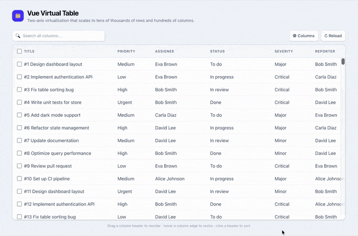

<div align="center">

# 🗂️ Vue Virtual Table

**A high-performance, two-dimensional virtualized data table for Vue 3.**

Efficiently render **tens of thousands of rows and hundreds of columns** with row
virtualization, horizontal column lazy-loading, drag-to-reorder, and live column resizing —
all without dropping a frame.

<br />

[](https://vuejs.org/)
[](https://www.typescriptlang.org/)
[](https://vite.dev/)
[](https://tailwindcss.com/)
[](https://vueuse.org/)

<br /><br />

**[🔗 Live Demo](https://mobinashakeri.github.io/vue-virtual-bi-table/)** &nbsp;·&nbsp; deployed automatically to GitHub Pages

</div>

---

## ✨ Why this project

Most table components virtualize **rows** only. Once a table gets *wide* — 20, 40, 100+
columns — every visible row still renders every cell, and the browser grinds to a halt.

**Vue Virtual Table solves both axes at once:**

- **Vertical virtualization** → only the rows in the viewport are mounted.
- **Horizontal lazy-loading** → within each rendered row, only the cells whose columns are
  on-screen (or about to be) render their content.

The result is a table that stays smooth as it scales to **tens of thousands of rows and
hundreds of columns** — while still supporting rich interactions like drag-to-reorder and
resizing. (The included demo generates 1,000 rows × 20 columns, but nothing in the design
caps it there.)

<br />

<div align="center">



_1,000 rows × 20 columns — vertical + horizontal virtualization, drag-to-reorder, and live resize._

</div>

---

## 🚀 Features

| | Feature | Details |
|---|---|---|
| ⚡ | **Row virtualization** | Powered by `useVirtualList` — renders only ~visible rows + overscan. |
| ↔️ | **Column lazy-loading** | `IntersectionObserver` per column renders off-screen cells as lightweight spacers. |
| 🔀 | **Drag-to-reorder columns** | Reorder columns via drag handles (title column locked in place). |
| 📥 | **Drag-to-move rows** | Optional row dragging with configurable groups & move guards. |
| ↔️ | **Resizable columns** | Live width resizing with min/max clamps and hover handles. |
| 📌 | **Sticky header & first column** | Header and the title column stay pinned while scrolling. |
| 🔄 | **Synced scroll** | Header and body scroll horizontally in lockstep. |
| ↕️ | **Sorting** | Click a header to cycle asc → desc → none, with an active-column indicator. |
| 🔍 | **Global search & filter** | Instantly filter across every column — stays smooth over the full dataset. |
| ☑️ | **Row selection** | Per-row checkboxes plus a select-all with indeterminate state. |
| 👁️ | **Column show / hide** | Toggle column visibility from a dropdown (click-outside to close). |
| 💀 | **Loading skeleton** | Shimmer placeholder rows while data loads. |
| 🧩 | **Slot-driven cells** | Fully customizable header and cell rendering via scoped slots. |
| 🛟 | **Type-safe** | Written in strict TypeScript end-to-end. |

---

## 🧠 How it works

The component is a **bi-dimensional virtualizer** (hence `VirtualBiTable`):


**Vertical axis —** `useVirtualList` (VueUse) computes the visible window from scroll
position and item height, then mounts only those rows. A spacer wrapper reserves the full
scroll height so the scrollbar behaves naturally.

**Horizontal axis —** on mount (and after any reorder), each column header registers an
`IntersectionObserver` against the horizontally-scrolling container, with a generous
`rootMargin` so cells are ready *before* they scroll in. A reactive `visibilityMap` drives
`shouldShowCell()`, which each row consults: off-screen columns render an empty, correctly-
sized placeholder instead of their real content — preserving layout while skipping work.

---

## 🏗️ Architecture

```
src/
├── components/
│   ├── VirtualBiTable.vue   # Orchestrator: virtualization, observers, scroll sync, DnD
│   ├── TaskTable.vue        # Demo host: toolbar (search, columns, selection, reload)
│   │                        #   + useTable / useMockData wiring around VirtualBiTable
│   ├── TableRow.vue         # A single row — renders visible cells via shouldShowCell()
│   └── Resizable.vue        # Reusable resize wrapper (drag handles + width/height clamps)
├── composables/
│   ├── useTable.ts          # Data pipeline: search → filter → sort, selection, visibility
│   └── useMockData.ts       # Generates 1,000+ realistic tasks for benchmarking
├── types/
│   ├── field.interface.ts   # Column definition (label, width, sticky, draggable…)
│   └── task.interface.ts    # Row definition (id + field values)
└── App.vue                  # Page shell (title header) that renders <TaskTable />
```

---

## 🛠️ Tech stack

- **[Vue 3](https://vuejs.org/)** (`<script setup>`, Composition API)
- **[TypeScript](https://www.typescriptlang.org/)** (strict)
- **[Vite](https://vite.dev/)** for dev/build
- **[Tailwind CSS v4](https://tailwindcss.com/)** for styling
- **[VueUse](https://vueuse.org/)** — `useVirtualList`, `useIntersectionObserver`, `onClickOutside`
- **[vuedraggable](https://github.com/SortableJS/vue.draggable.next)** (SortableJS) for drag & drop

---

## 📦 Getting started

```bash
# install
npm install

# run the dev server
npm run dev

# type-check + production build
npm run build

# preview the production build
npm run preview
```

Then open the local URL Vite prints (default `http://localhost:5173`).

### Quality scripts

```bash
npm run test        # run the unit tests (Vitest, watch mode)
npm run test:run    # run the tests once (CI)
npm run type-check  # vue-tsc type checking
npm run lint        # ESLint (+ autofix)
npm run format      # Prettier
```

Tests cover the `useTable` pipeline (search, sort, selection, column visibility)
and the row component. Pushing to `main` builds, tests, and deploys the live
demo to GitHub Pages via [GitHub Actions](.github/workflows/deploy.yml).

---

## 🔌 Usage

Minimal — just columns and rows:

```vue
<script setup lang="ts">
import VirtualBiTable from "@/components/VirtualBiTable.vue";
import { useMockData } from "@/composables/useMockData";

const { fields, tasks, generate } = useMockData(1000);
generate();
</script>

<template>
  <VirtualBiTable
    v-model:table-header-items="fields"
    v-model:table-body-items="tasks"
  />
</template>
```

Full-featured — the `useTable` composable adds search, sort, selection and column
visibility, and the table renders the UI for them:

```vue
<script setup lang="ts">
import { useMockData } from "@/composables/useMockData";
import { useTable } from "@/composables/useTable";

const { fields, tasks, generate } = useMockData(1000);
generate();

const {
  search, sortKey, sortDir, toggleSort,
  visibleColumns, rows,
  selected, allSelected, someSelected, toggleRow, toggleAll,
} = useTable(fields, tasks);
</script>

<template>
  <input v-model="search" placeholder="Search…" />
  <VirtualBiTable
    v-model:table-header-items="visibleColumns"
    :table-body-items="rows"
    selectable
    :sort-key="sortKey"
    :sort-dir="sortDir"
    :selected-ids="selected"
    :all-selected="allSelected"
    :some-selected="someSelected"
    @sort="toggleSort"
    @toggle-row="toggleRow"
    @toggle-all="toggleAll"
  />
</template>
```

### Props

| Prop | Type | Default | Description |
|---|---|---|---|
| `tableHeaderItems` (`v-model`) | `Field[]` | `[]` | Column definitions (label, width, `sticky`, `draggable`). Two-way for reorder/resize. |
| `tableBodyItems` (`v-model`) | `Task[]` | `[]` | The rows to render. |
| `bodyHeight` | `number` | `300` | Height of the scroll viewport (px). |
| `itemHeight` | `number` | `44` | Row height, used by the virtualizer (px). |
| `virtualScan` | `number` | `50` | Overscan — extra rows rendered outside the viewport. |
| `fixedHeader` | `boolean` | `true` | Keep the header row sticky. |
| `sortable` | `boolean` | `true` | Allow column drag-to-reorder. |
| `itemDraggable` | `boolean` | `false` | Allow row drag-to-move. |
| `loading` | `boolean` | `false` | Show the skeleton placeholder. |
| `selectable` | `boolean` | `false` | Render selection checkboxes. |
| `sortKey` / `sortDir` | `string` / `"asc"｜"desc"` | — | Active sort column & direction (for the indicator). |
| `selectedIds` | `Set<string>` | — | Currently-selected row ids. |
| `allSelected` / `someSelected` | `boolean` | `false` | Select-all checkbox state (incl. indeterminate). |

### Emits

`sort` · `toggleRow` · `toggleAll` · `change` · `headerMoved` · `resizeStart` · `moveRow`

### Slots

- `#item="{ row, index }"` — override an entire row (`row` is the virtualized wrapper; your `Task` is `row.data`).
- `#cell="{ header, index, row }"` — override how a single cell renders (badges, avatars, …). The component ships **no** hard-coded cell styling, so all visual design lives here in the consumer.

---

## 👤 Author

**Mobina Shakeri**
[GitHub](https://github.com/mobinashakeri) · [LinkedIn](https://www.linkedin.com/in/mobina-shakeri)

---

## 📄 License

Released under the [MIT License](LICENSE).
