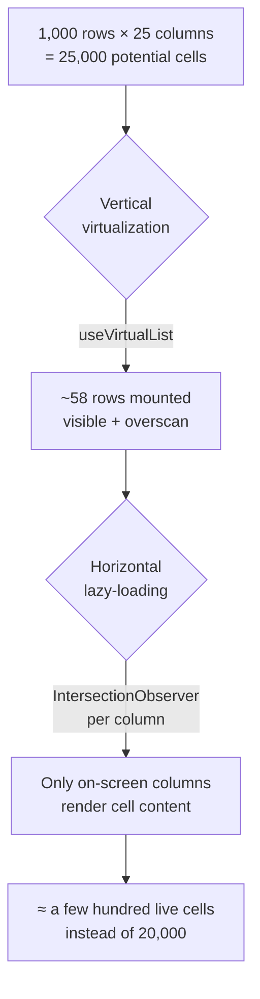

<div align="center">

# 🗂️ Vue Virtual bi Table

**A high-performance, two-dimensional virtualized data table for Vue 3.**

Smoothly render **50,000 rows** with row virtualization, horizontal column lazy-loading,
drag-to-reorder, and live column resizing — comfortable up to **~25 columns** (more with
lightweight cells). See [Performance &amp; sizing](#-performance--sizing).

<br />

[](https://vuejs.org/)
[](https://www.typescriptlang.org/)
[](https://vite.dev/)
[](https://tailwindcss.com/)
[](https://vueuse.org/)

<br /><br />

**[🔗 Live Demo](https://mobinashakeri.github.io/vue-virtual-bi-table/)** &nbsp;·&nbsp; deployed automatically to GitHub Pages

</div>

---

## ✨ Why this project

Most table components virtualize **rows** only. Once a table gets *wide* — 20, 40, 100+
columns — every visible row still renders every cell, and the browser grinds to a halt.

**Vue Virtual Bi Table solves both axes at once:**

- **Vertical virtualization** → only the rows in the viewport are mounted.
- **Horizontal lazy-loading** → within each rendered row, only the cells whose columns are
  on-screen (or about to be) render their content.

The result stays smooth across **tens of thousands of rows** and a couple dozen columns —
while still supporting rich interactions like drag-to-reorder and resizing. The vertical axis
scales freely (50,000 rows is comfortable); the horizontal axis is the one to size for — see
[Performance &amp; sizing](#-performance--sizing) for concrete limits. (The demo runs 1,000
rows × 25 columns.)

<br />

<div align="center">


_1,000 rows × 20 columns — vertical + horizontal virtualization, drag-to-reorder, and live resize._

</div>

---

## 🚀 Features

| | Feature | Details |
|---|---|---|
| ⚡ | **Row virtualization** | Powered by `useVirtualList` — renders only ~visible rows + overscan. |
| ↔️ | **Column lazy-loading** | `IntersectionObserver` per column renders off-screen cells as lightweight spacers. |
| 🔀 | **Drag-to-reorder columns** | Reorder columns via drag handles (title column locked in place). |
| 📥 | **Drag-to-move rows** | Optional row dragging with configurable groups & move guards. |
| ↔️ | **Resizable columns** | Live width resizing with min/max clamps and hover handles. |
| 📌 | **Sticky header & first column** | Header and the title column stay pinned while scrolling. |
| 🔄 | **Synced scroll** | Header and body scroll horizontally in lockstep. |
| ↕️ | **Sorting** | Click a header to cycle asc → desc → none, with an active-column indicator. |
| 🔍 | **Global search & filter** | `useTable` filters across every column, smooth over the full dataset (you render the search input). |
| ☑️ | **Row selection** | Per-row checkboxes plus a select-all with indeterminate state. |
| 👁️ | **Column show / hide** | `useTable` tracks hidden columns (you render the toggle UI). |
| 💀 | **Loading skeleton** | Shimmer placeholder rows while data loads. |
| 🧩 | **Slot-driven cells** | Fully customizable header and cell rendering via scoped slots. |
| 🛟 | **Type-safe** | Written in strict TypeScript end-to-end. |

---

## 🧠 How it works

The component is a **bi-dimensional virtualizer** (hence `VirtualBiTable`):



**Vertical axis —** `useVirtualList` (VueUse) computes the visible window from scroll
position and item height, then mounts only those rows. A spacer wrapper reserves the full
scroll height so the scrollbar behaves naturally.

**Horizontal axis —** on mount (and after any reorder), each column header registers an
`IntersectionObserver` against the horizontally-scrolling container, with a generous
`rootMargin` so cells are ready *before* they scroll in. A reactive `visibilityMap` drives
`shouldShowCell()`, which each row consults: off-screen columns render an empty, correctly-
sized placeholder instead of their real content — preserving layout while skipping work.

---

## ⚡ Performance & sizing

The two axes scale very differently — size your table accordingly.

**Rows scale freely.** Only the rows in the viewport (plus a small overscan) are ever
mounted, so scrolling cost is fixed by what's *visible*, not by the total. **50,000 rows
stay smooth.** At that scale the practical ceiling is memory — each row holds one cell per
column — not rendering.

**Columns are the axis to watch.** Every mounted row renders one cell per column, so per-row
work grows with the column count. With typical cells (text, badges, small components):

| Columns | Scrolling |
|---|---|
| ≤ 15 | effortless (~60 fps) |
| **~25** | **smooth for everyday use — the recommended ceiling** |
| 40–50 | usable, but choppy on fast scrolling |
| 100+ | janky |

### Rules of thumb

- **50,000 rows × ~25 columns** is the comfortable sweet spot — smooth in normal use.
- You can go **beyond 25 columns when your cells are lightweight** (plain text or small badges).
- A **heavy component in every cell** (charts, editors, rich widgets) lowers the ceiling —
  keep it **at or below ~25 columns**. Prefer rendering heavy cells only in the columns that
  need them, via `#col-cell-<key>`, and leaving the rest as light text.

### If you need more headroom

- **Hide columns you don't need** — only rendered columns cost anything, so column show/hide
  is a genuine performance lever.
- Keep per-cell components **cheap to mount** (defer expensive work; avoid per-cell async).
- Lower `overscan` to trim memory and mount cost.

> Figures measured in Chrome with 50,000 rows; exact numbers vary with hardware, column
> widths, and cell complexity.

---

## 🏗️ Architecture

```
src/
├── components/
│   ├── VirtualBiTable.vue   # Orchestrator: virtualization, observers, scroll sync, DnD
│   ├── Example.vue          # Demo/example only (NOT published): a toolbar (search,
│   │                        #   columns, selection) wiring useTable around VirtualBiTable
│   ├── TableRow.vue         # A single row — renders visible cells via shouldShowCell()
│   └── Resizable.vue        # Reusable resize wrapper (drag handles + width/height clamps)
├── composables/
│   ├── useTable.ts          # Data pipeline: search → filter → sort, selection, visibility
│   └── useMockData.ts       # Generates 1,000+ realistic tasks for benchmarking
├── types/
│   ├── field.interface.ts   # Column definition (label, width, sticky, draggable…)
│   └── task.interface.ts    # Row definition (id + field values)
└── App.vue                  # Page shell (title header) that renders <Example />
```

---

## 🛠️ Tech stack

- **[Vue 3](https://vuejs.org/)** (`<script setup>`, Composition API)
- **[TypeScript](https://www.typescriptlang.org/)** (strict)
- **[Vite](https://vite.dev/)** for dev/build
- **[Tailwind CSS v4](https://tailwindcss.com/)** for styling
- **[VueUse](https://vueuse.org/)** — `useVirtualList`, `useIntersectionObserver`, `onClickOutside`
- **[vuedraggable](https://github.com/SortableJS/vue.draggable.next)** (SortableJS) for drag & drop

---

## 📦 Installation

```bash
npm install vue-virtual-bi-table
```

`vue` (^3.5) is a peer dependency. Import the component and the stylesheet once:

```ts
import { VirtualBiTable } from "vue-virtual-bi-table";
import "vue-virtual-bi-table/style.css";
```

The stylesheet ships only the classes the component uses — **no global CSS reset** —
so it won't touch the rest of your app.

---

## 🧑‍💻 Local development

```bash
# install
npm install

# run the demo dev server
npm run dev

# type-check + production build
npm run build

# preview the production build
npm run preview
```

Then open the local URL Vite prints (default `http://localhost:5173`).

### Quality scripts

```bash
npm run test        # run the unit tests (Vitest, watch mode)
npm run test:run    # run the tests once (CI)
npm run type-check  # vue-tsc type checking
npm run lint        # ESLint (+ autofix)
npm run format      # Prettier
```

Tests cover the `useTable` pipeline (search, sort, selection, column visibility)
and the row component. Pushing to `main` builds, tests, and deploys the live
demo to GitHub Pages via [GitHub Actions](.github/workflows/deploy.yml).

---

## 🧱 Data model

Two shapes drive the table — **columns** (`Field[]`, bound to `v-model:cols`) and
**rows** (`Task[]`, bound to `v-model:rows`).

```ts
interface Field {
  _id: string          // unique column id; a row's cell matches a column by this
  key?: string         // friendly slot id (#col-cell-<key>); use when _id is opaque, falls back to _id
  label: string        // header text
  width?: number       // column width in px
  value: any           // the cell value (on row cells; columns carry a placeholder)
  sticky?: boolean     // pin the column (the first column is always sticky)
  draggable?: boolean  // set false to lock this column's position
}

interface Task {
  _id: string          // unique row id
  field: Field[]       // one entry per cell — its `_id` matches the column's `_id`
}
```

**Columns and cells are matched by `_id`.** A row renders a column by finding the
`field` entry whose `_id` equals the column's `_id`, then showing its `value`:

```ts
const cols: Field[] = [
  { _id: "title",      label: "Title",  width: 300, sticky: true, value: "" },
  { _id: "col_8f21a9", key: "status", label: "Status", width: 150, value: "" },
]

const rows: Task[] = [
  {
    _id: "task_1",
    field: [
      { _id: "title",      label: "Title",  value: "Design dashboard" },
      { _id: "col_8f21a9", label: "Status", value: "In progress" },
    ],
  },
]
```

Here the Status column's `_id` is opaque, so it sets `key: "status"` — you then
target its slots as `#col-header-status` / `#col-cell-status`.

---

## 🔌 Usage

Minimal — just columns and rows:

```vue
<script setup lang="ts">
import { ref } from "vue";
import { VirtualBiTable, type Field, type Task } from "vue-virtual-bi-table";
import "vue-virtual-bi-table/style.css";

const cols = ref<Field[]>([
  { _id: "title", label: "Title", width: 300, sticky: true, value: "" },
  { _id: "status", label: "Status", width: 150, value: "" },
]);

const rows = ref<Task[]>([
  {
    _id: "1",
    field: [
      { _id: "title", label: "Title", value: "Design dashboard" },
      { _id: "status", label: "Status", value: "In progress" },
    ],
  },
]);
</script>

<template>
  <VirtualBiTable v-model:cols="cols" v-model:rows="rows" />
</template>
```

Full-featured — the `useTable` composable **manages** search, sort, selection and
column-visibility *state*. You render your own controls (search box, column toggle)
and feed the state into the table. The table stays chrome-free on purpose, so your
toolbar matches your app:

```vue
<script setup lang="ts">
import { ref } from "vue";
import {
  VirtualBiTable,
  useTable,
  type Field,
  type Task,
} from "vue-virtual-bi-table";
import "vue-virtual-bi-table/style.css";

const fields = ref<Field[]>(/* your columns */);
const tasks = ref<Task[]>(/* your rows */);

const {
  search, sortKey, sortDir, toggleSort,
  visibleColumns, rows,
  selected, allSelected, someSelected, toggleRow, toggleAll,
} = useTable(fields, tasks);
</script>

<template>
  <!-- Your own toolbar goes here — e.g. <input v-model="search"> and a
       column-toggle menu — wired to the values from useTable above.
       (See Example.vue in the repo for a full toolbar.) -->
  <VirtualBiTable
    v-model:cols="visibleColumns"
    v-model:rows="rows"
    selectable
    :sort-key="sortKey"
    :sort-dir="sortDir"
    :selected-ids="selected"
    :all-selected="allSelected"
    :some-selected="someSelected"
    @sort="toggleSort"
    @toggle-row="toggleRow"
    @toggle-all="toggleAll"
  />
</template>
```

### Props

| Prop | Type | Default | Description |
|---|---|---|---|
| `cols` (`v-model`) | `Field[]` | `[]` | Column definitions (label, width, `sticky`, `draggable`). Two-way for reorder/resize. |
| `rows` (`v-model`) | `Task[]` | `[]` | The rows to render. |
| `bodyHeight` | `number` | `300` | Height of the scroll viewport (px). |
| `itemHeight` | `number` | `44` | Row height, used by the virtualizer (px). |
| `overscan` | `number` | `50` | Extra rows rendered above & below the viewport. Higher = fewer blank flashes on fast scroll but more memory/mount cost; lower = leaner. |
| `fixedHeader` | `boolean` | `true` | Keep the header row sticky. |
| `sortable` | `boolean` | `true` | Enable click-to-sort on headers. When `false`, headers are static labels. (Column drag-reorder is separate — lock a column with `draggable: false` on its `Field`.) |
| `itemDraggable` | `boolean` | `false` | Enable **row** drag-to-reorder. Pair with `v-model:rows` (auto-applies the new order) or listen to `@move-row`. |
| `loading` | `boolean` | `false` | Show the skeleton placeholder. |
| `selectable` | `boolean` | `false` | Render row + select-all checkboxes. |
| `sortKey` / `sortDir` | `string` / `"asc"｜"desc"` | — | Active sort column & direction (for the indicator). |
| `selectedIds` | `Set<string>` | — | Currently-selected row ids. |
| `allSelected` / `someSelected` | `boolean` | `false` | Select-all checkbox state (incl. indeterminate). |

### Emits

`sort` · `toggleRow` · `toggleAll` · `change` · `headerMoved` · `resizeStart` · `moveRow`

**Reordering rows** — set `item-draggable`, then drag a row. On drop the table emits:

```ts
@move-row="(e: { row: Task; oldIndex: number; newIndex: number; rows: Task[] }) => { … }"
```

`rows` is the already-reordered array. If you `v-model:rows`, the new order is applied for
you; otherwise apply `e.rows` yourself. (Row drag is best when the list isn't sorted/filtered —
`useTable` exposes `isSourceOrder` for exactly this gate.)

### Slots

Every header and body cell is customizable. Target **one** column by its `key`
(falls back to `_id`), or **all** columns via the fallback slot:

| Slot | Scope | Renders |
|---|---|---|
| `#col-header` | `{ column, index, sorted, dir, toggleSort }` | every header |
| `#col-header-<key>` | same | one column's header (e.g. `#col-header-status`) |
| `#col-cell` | `{ column, value, row, rowIndex, index }` | every body cell |
| `#col-cell-<key>` | same | one column's body cell (e.g. `#col-cell-status`) |

Resolution is **per-column → fallback → built-in default**. The checkbox, resize
grip and drag handle stay *outside* the slot, so a custom header keeps sorting
(call `toggleSort`), resizing and dragging. `value` is pre-resolved, so you never
touch the internal row shape.

```vue
<VirtualBiTable v-model:cols="cols" v-model:rows="rows">
  <!-- one column's header -->
  <template #col-header-status="{ column, sorted, dir, toggleSort }">
    <button @click="toggleSort">
      {{ column.label }} <span v-if="sorted">{{ dir === "asc" ? "↑" : "↓" }}</span>
    </button>
  </template>

  <!-- one column's body cell -->
  <template #col-cell-status="{ value }">
    <StatusPill :value="value" />
  </template>
</VirtualBiTable>
```

---

## 👤 Author

**Mobina Shakeri**
[GitHub](https://github.com/mobinashakeri) · [LinkedIn](https://www.linkedin.com/in/mobina-shakeri)

---

## 📄 License

Released under the [MIT License](LICENSE).
